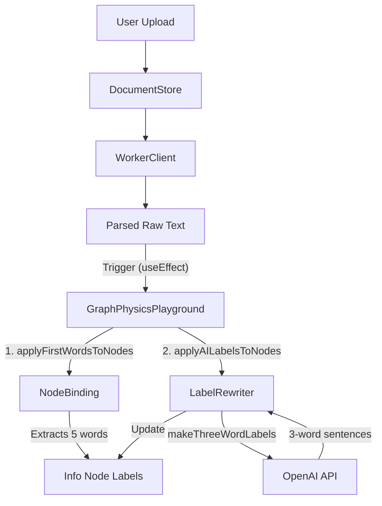

# Paper Analyzer Pipeline Scan

**Date**: 2026-01-28
**Status**: Dissected

## 1. Overview
The user requested a scan of the pipeline where an uploaded document is parsed, its content is applied to graph nodes (First 5 words), and then AI rewrites them into "3-word labels".

## 2. Component Breakdown

### A. Parsing Layer
-   **Worker Client**: `src/document/workerClient.ts`
-   **Worker**: `src/document/documentWorker.ts`
-   **Logic**: The worker receives the `File`, chooses a parser (PDF/Docx/Text), and extracts raw text. It returns a `ParsedDocument` object containing the `text` string.

### B. Binding Layer (The "Connector")
-   **File**: `src/document/nodeBinding.ts`
-   **Functions**:
    1.  `applyFirstWordsToNodes(engine, document)`:
        -   Splits `document.text` by whitespace.
        -   Takes the first 5 words.
        -   Directly mutates `engine.nodes[i].label`.
    2.  `applyAILabelsToNodes(engine, words, ...)`:
        -   Calls the AI Rewriter.
        -   Updates `engine.nodes[i].label` with the 3-word results.

### C. AI Transformation Layer
-   **File**: `src/ai/labelRewriter.ts`
-   **Function**: `makeThreeWordLabels(words[])`
-   **Logic**:
    -   Calls `client.generateText` with a prompt to turn 5 words into 3-word sentences.
    -   Validates output is exactly 5 lines.
    -   Fallbacks to original words if AI fails/timeouts.

### D. Trigger Point (The "Controller")
-   **File**: `src/playground/GraphPhysicsPlayground.tsx`
-   **Flow**:
    -   Watches `documentState.activeDocument`.
    -   When a new document arrives, it calls `applyFirstWordsToNodes`.
    -   Immediately after, it calls `applyAILabelsToNodes` (async).

## 3. Data Flow Diagram

## 4. Current Limitations (For Future "Robust Paper Analyzer")
1.  **Naive Extraction**: It blindly takes the *first 5 words* of the document. For a PDF, this might be "Table of Contents" or "Chapter 1 Introduction".
2.  **Hardcoded Count**: functional limit of exactly 5 nodes/labels.
3.  **No Semantic Analysis**: The AI just rewrites the random first 5 words; it doesn't read the *document* to find the *best* 5 concepts.

## 5. Conclusion
The pipeline is well-separated but the extraction logic is extremely naive. To build a "Robust Paper Analyzer", we will need to:
1.  Pass the (truncated) document text to the AI.
2.  Ask AI to *extract* the top 5 concepts, rather than just rewriting the first 5 words.
