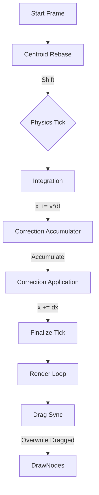

# Forensic Report: `node.x/y` Write Ownership

**Date:** 2026-02-01
**Target:** `PhysicsNode.x` and `PhysicsNode.y` (Canonical Position Fields)

## 1. The Canonical Reader (Renderer)
The renderer reads directly from the `PhysicsNode` instances located in `engine.nodes`. There is no intermediate "render buffer" or double-buffering for positions.

-   **File:** `src/playground/rendering/graphDraw.ts`
-   **Function:** `drawNodes`
-   **Read Location:**
    ```typescript
    // Fix 42: Manual Projection & Scaling
    let screen = worldToScreen(node.x, node.y);
    ```
-   **Implication:** Whatever value is in `node.x` at the moment `drawNodes` is called (in the `requestAnimationFrame` loop) is what gets drawn.

## 2. The Physics Write Timeline (Tick Order)
The physics tick (`engineTick.ts`) runs at 60Hz deterministic. The write order within a single tick is:

| Stage | Writer Function | File | Impact on `node.x/y` | Notes |
| :--- | :--- | :--- | :--- | :--- |
| **0. Rebase** | `runPhysicsTick` (Inline) | `engineTick.ts` | **Direct Write** (`n.x -= cx`) | **Hidden Writer.** Triggers if `maxPos > 50,000`. Shifts entire world to preserve float precision. |
| **1. Forces** | `applyForcePass` | `forcePass.ts` | No | Accumulates `node.fx/fy`. |
| **2. Velocity** | `applyDragVelocity`, `applyDamping` | `velocityPass.ts` | No | Updates `node.vx/vy`. |
| **3. Integration** | `integrateNodes` | `integration.ts` | **Direct Write** (`node.x += node.vx * dt`) | **Primary Mover.** Moves nodes based on velocity. |
| **4. Constraints** | `applySpacing`, `applySafety`, etc. | `constraints.ts` | No | Writes to `correctionAccum` (Buffer). NO direct position mutation here. |
| **5. Correction** | `applyCorrectionsWithDiffusion` | `corrections.ts` | **Direct Write** (`node.x += selfDx`) | **Final Physics Writer.** Applies standard PBD corrections + Diffusion. |
| **6. Finalize** | `finalizePhysicsTick` | `engineTickFinalize.ts` | No | Reads `node.x` to update `lastGoodX`. |

## 3. The "After-Tick" Writers (Hidden / Vibe Killers)
These run *after* `engine.tick()` but *before* `drawNodes()`, inside the main render loop.

| Writer | Function | File | Impact | Risk |
| :--- | :--- | :--- | :--- | :--- |
| **Drag Sync** | `applyDragTargetSync` | `graphRenderingLoop.ts` | **Overwrites** (`dragged.x = target.x`) | **High**. For the dragged node, the physics calculation is *ignored* and replaced by mouse position immediately before draw. |
| **Drop Debt** | `runPhysicsScheduler` | `renderLoopScheduler.ts` | None | Drops time (debt), doesn't mutate positions. |

## 4. Write-Ownership Graph



## 5. Conclusions
1.  **Last Physics Writer:** `applyCorrectionsWithDiffusion` (in `src/physics/engine/corrections.ts`).
    -   Any XPBD logic must sit **here** or immediately after this function call in `engineTick.ts`.
    -   If placed before, it competes with `correctionAccum`.
    -   If placed after, it is the Final Authority (before render).

2.  **The "Pen Holder":**
    -   For **Normal Nodes**: `applyCorrectionsWithDiffusion`.
    -   For **Dragged Nodes**: `applyDragTargetSync` (Render Loop).

3.  **XPBD Injection Point:**
    -   Insert **after** `applyCorrectionsWithDiffusion` in `engineTick.ts`.
    -   This ensures XPBD corrections apply *on top* of standard PBD safety clamps, effectively refining the result.

## 6. Risk List
1.  **Centroid Rebase:** If XPBD stores internal position state (prevX/PBD state), it MUST listen to `engine.onWorldShift` or re-read `node.x` every frame, otherwise it will try to "correct" the massive rebase shift.
2.  **Drag Overwrite:** XPBD cannot constrain the dragged node (it is infinite mass/fixed). `applyDragTargetSync` will clobber any changes to the dragged node.
