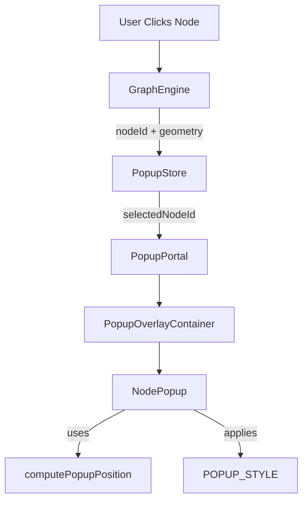

# Membrane Animation Report: NodePopup

This document provides a complete operational understanding of the "membrane animation" used in the `NodePopup` component. This effect is designed to make UI elements feel like they emerge organically from a specific point in space (a node), rather than appearing as static boxes.

---

## A) WHERE IT LIVES (ENTRY POINTS)

### 1. Primary Implementation
- **Component File**: `src/popup/NodePopup.tsx`
  - Defines the animation states (`POPUP_STYLE` and `POPUP_VISIBLE_STYLE`).
  - Implements the lifecycle logic for staged reveal (container then content).
  - Calculates the `transform-origin` pivot point dynamically.

### 2. Supporting Infrastructure
- **Store**: `src/popup/PopupStore.tsx`
  - Manages the `isOpen` state and `anchorGeometry` (the "birthplace" of the popup).
- **Portal & Container**: 
  - `src/popup/PopupPortal.tsx`: Standardized mounting point.
  - `src/popup/PopupOverlayContainer.tsx`: Provides the `fixed` viewport context and `z-index: 1000`.
- **Types**: `src/popup/popupTypes.ts`
  - Defines `AnchorGeometry` (x, y, radius) required for the effect.

### 3. Dependency Map


---

## B) WHAT IT DOES (BEHAVIORAL SPEC)

The animation mimics a physical membrane stretching or a lens focusing. It transitions from a "hidden/blurred" state to a "focused/solid" state.

### 1. The Timeline (t=0 → t=450ms)
- **t=0**: Component mounts. `isVisible` is false. Style is set to `POPUP_STYLE` (scale 0.8, blurred, invisible).
- **t=10ms**: `isVisible` becomes true. CSS transitions begin.
- **t=200ms**: Content starts its own sub-animation (fade + slide up).
- **t=400ms**: Main container transition completes (scale/opacity).
- **t=450ms**: Final layout settle; `transitionend` fires and the final geometry is reported to `PopupStore` via `setPopupRect` for child positioning (e.g., MiniChatbar).

### 2. Visual Values & Easing
| Property | Start State | End State | Easing Function | Duration |
| :--- | :--- | :--- | :--- | :--- |
| **Scale** | `0.8` | `1.0` | `cubic-bezier(0.34, 1.56, 0.64, 1)` (Back Out) | 400ms |
| **Opacity** | `0` | `1` | `cubic-bezier(0.16, 1, 0.3, 1)` (Quart Out) | 400ms |
| **Blur** | `8px` | `0px` | `cubic-bezier(0.16, 1, 0.3, 1)` | 350ms |
| **Backdrop Blur**| `0px` | `12px` | `ease-out` | 300ms |
| **Shadow Alpha** | `0` | `0.4` | `ease-out` (50ms delay) | 400ms |

### 3. The "Membrane" Feel
- **Squish/Stretch**: Achieved via the **Back Out** easing curve (`0.34, 1.56, 0.64, 1`). This causes a slight overshoot (scaling to ~1.05 and settling back), giving it a supple, elastic feel.
- **Reveal**: The staged content reveal (delayed by 200ms) prevents "visual noise" during the primary container expansion.
- **Emergence**: The `transform-origin` is set exactly to the node's center, making the popup expand "away" from the node.

---

## C) HOW IT’S APPLIED (MECHANISM)

### 1. Trigger Site
The trigger is a "double-bounce" `useEffect` that ensures the browser has one frame to register the initial state before the transition class/style is applied.

```typescript
// src/popup/NodePopup.tsx
useEffect(() => {
    setIsVisible(false);
    setContentVisible(false);
    // 10ms delay ensures initial hidden styles are painted
    const containerTimer = setTimeout(() => setIsVisible(true), 10);
    const contentTimer = setTimeout(() => setContentVisible(true), 200);
    return () => {
        clearTimeout(containerTimer);
        clearTimeout(contentTimer);
    };
}, [selectedNodeId]);
```

### 2. Geometry & Pivot Calculation
The "emergence" effect depends entirely on calculating where the node is relative to the popup's top-left corner.

```typescript
// src/popup/NodePopup.tsx
function computePopupPosition(...) {
    // ... clipping/clamping logic ...
    
    // Origin relative to popup's top-left corner
    const originX = anchor.x - left;
    const originY = anchor.y - top;

    return { left, top, originX, originY };
}
```

### 3. Style Application
The styles are applied as plain CSS transitions on the outer container. This avoids layout thrash because it only affects composite layers (`transform`, `opacity`, `filter`).

---

## D) BOLTING CONTRACT (HOW TO REUSE RELIABLY)

To apply this "membrane" behavior to a new window/component, follow this checklist:

1.  **Fixed Context**: The component MUST be inside a `position: fixed` or `position: absolute` container that covers the viewport (like `PopupOverlayContainer`).
2.  **Anchor Input**: The component requires an `anchor` object `{ x: number, y: number }` representing the source of the animation.
3.  **Dynamic Transform-Origin**: 
    - Compute `left`/`top` for the component.
    - Set `transformOrigin` style to `${anchor.x - left}px ${anchor.y - top}px`.
4.  **Initial Painted State**: You cannot go from `display: none` to `display: flex` with a transition. You must mount the component with `opacity: 0` and trigger the visible state via a `setTimeout` or `requestAnimationFrame`.
5.  **CSS Invariants**:
    - `transition`: Must include `transform`, `opacity`, and `filter`.
    - `will-change`: Set to `transform, opacity, filter` if performance lags.
    - `pointer-events`: Ensure the hidden state is `pointer-events: none` if it lingers, or simply don't mount until triggered.

---

## E) FAILURE MODES (SLIPPERY PITFALLS)

| Failure | Cause | Detection |
| :--- | :--- | :--- |
| **"Sliding Box"** | `transform-origin` defaulted to `50% 50%`. | Popup expands from its own center instead of the mouse/node. |
| **"Staccato Flash"** | Transition triggered without the 10ms delay. | Popup appears instantly with no animation. |
| **"Ghosting"** | `backdrop-filter` on high-DPI screens. | Visual artifacts or low FPS during the scale. |
| **"Cut-off Corners"**| `overflow: hidden` on a parent element. | Shadows or blurred edges are clipped. |
| **"Layer War"** | `z-index` conflict with the Graph Engine. | Popup appears behind nodes or grid lines. |

---

## F) MODIFICATION KNOBS

All constants are currently defined in `src/popup/NodePopup.tsx`.

1.  **Elasticity (Overshoot)**: 
    - **Where**: `POPUP_STYLE.transition` -> `cubic-bezier(0.34, 1.56, ...)`
    - **Effect**: Increase `1.56` for a "boing" effect; decrease to `1.0` for a flat, mechanical entry.
2.  **Membrane Thickness (Inner Glow)**:
    - **Where**: `POPUP_STYLE.backgroundColor` (currently `rgba(20, 20, 30, 0.95)`).
    - **Effect**: Adjust alpha for transparency. Add a `1px` solid border for a "glass" edge.
3.  **Depth (Shadow)**:
    - **Where**: `POPUP_VISIBLE_STYLE.boxShadow`.
    - **Effect**: Increase spread/blur for higher "altitude" above the graph.
4.  **Sequencing**:
    - **Where**: `contentTimer` delay (currently `200ms`).
    - **Effect**: Longer delay makes the window feel "heavy" and the content "light".

---

## G) QUICK DEMO INSTRUCTIONS

1.  Launch the application: `npm run dev`.
2.  **Trigger**: Click any node in the graph.
3.  **Observe**:
    - The window should sprout *out* from the node.
    - It should bounce slightly (overshoot).
    - The content (text/chat) should slide in *after* the window is mostly expanded.
4.  **Verification**: 
    - Close the popup and click a node on the far side of the screen.
    - The "emergence direction" should change because the pivot point (`transform-origin`) is recalculated.
