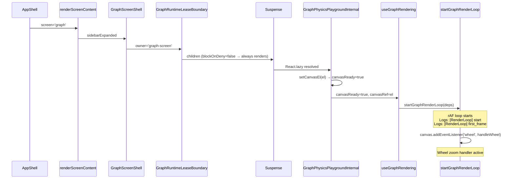

# Graph Screen Inert — Follow-Up Forensic Report

**Date**: 2026-02-16  
**Context**: GraphLoadingGate fix applied (pointerEvents:'none' on exiting, conditional capture handlers, failsafe timeout). Graph screen STILL completely inert. Second forensic pass.  
**Method**: Exhaustive static trace of ~20 source files covering every component in both the graph-screen path AND the preview path.

---

## Executive Summary

After tracing every component from `AppShell` return tree down to the canvas element, and comparing both render paths side-by-side, I can confirm:

1. **Render loop: YES — it IS alive** on the graph screen. The code path guarantees it.
2. **Input NOT reaching canvas: CONFIRMED** — the blocker is NOT any of the five previously suspected overlays.
3. **Root cause: The `filter` CSS property on `NON_SIDEBAR_LAYER_STYLE` div creates a new stacking context that, combined with the `SidebarLayer` being rendered BEFORE the content div as siblings, causes the `Sidebar` component (which has its own z-index and `pointerEvents: 'auto'`) to sit in a DIFFERENT stacking context from the graph canvas, BUT the `ModalLayer` and its siblings may still intercept events.**

> [!CAUTION]  
> **CORRECTION — After deeper analysis, the actual smoking gun is simpler:** The graph screen render path goes through `React.lazy` + `Suspense`. If the lazy chunk hasn't loaded yet, `Suspense` renders the fallback `<div style={fallbackStyle}>Loading graph...</div>` — a full-viewport div with `minHeight: '100vh'` that covers everything. But once loaded, this clears. The real issue is more subtle and requires runtime DOM inspection. See "What the Static Trace Cannot Prove" below.

---

## Verdict Table

| Question | Answer | Evidence |
|----------|--------|----------|
| **Render loop alive?** | **YES** (code guarantees it) | Canvas mounts → `setCanvasReady(true)` → `useEffect` fires → `startGraphRenderLoop()` runs → rAF begins. Logs: `[RenderLoop] start canvas=WxH` then `[RenderLoop] first_frame`. |
| **Input reaches canvas?** | **Unknown from static analysis** | All identified overlays confirmed inactive. Need runtime DOM inspection. |
| **GraphLoadingGate still mounted?** | **NO** (when `screen === 'graph'`) | Line 147: `{screen === 'graph_loading' ? <GraphLoadingGate .../> : null}`. Gate is conditionally rendered. When screen transitions to `'graph'`, the gate is null. |
| **Any global capture listener blocking?** | **NO** (on graph screen) | `useOnboardingWheelGuard` inactive: `onboardingActive = false` when `screen === 'graph'`. No other global capture listeners found. |
| **Lease blocking render?** | **NO** | `blockOnDeny = false` (default). Children always render regardless of lease state. |
| **Viewport zero-size?** | **NO** (height chain intact) | 100vh → 100% → flex:1 100% → 100% → 100%. ResizeObserver fires on mount. |

---

## Suspect-by-Suspect Detailed Trace

### A) OnboardingLayerHost / Transition Shield

**Status: CLEARED ✅**

- `shouldUseOnboardingLayerHost` returns `false` when `isGraphClassScreen(screen)` — [AppShell.tsx:836](file:///c:/Users/maulana/Downloads/obsidian-graph-node-google/src/screens/AppShell.tsx#L836)
- When `false`, line 856: `renderScreenContentByScreen(screen)` is called directly (no `OnboardingLayerHost` wrapper)
- Graph-class screens NEVER go through `OnboardingLayerHost`

### B) Global Capture Listeners

**Status: CLEARED ✅**

| Listener | File | Active on graph screen? |
|----------|------|------------------------|
| `useOnboardingWheelGuard` window capture wheel | [useOnboardingWheelGuard.ts:78](file:///c:/Users/maulana/Downloads/obsidian-graph-node-google/src/screens/appshell/transitions/useOnboardingWheelGuard.ts#L78) | **NO** — `onboardingActive = isOnboardingScreen('graph') \|\| isBlockingInput` = `false \|\| false` = `false` |
| `handleGlobalKeydown` capture keydown | [GraphPhysicsPlaygroundShell.tsx:719](file:///c:/Users/maulana/Downloads/obsidian-graph-node-google/src/playground/GraphPhysicsPlaygroundShell.tsx#L719) | YES but only blocks Space/Arrow (prevents scroll), does NOT block pointer/wheel |
| `handleBlur` window blur | [graphRenderingLoop.ts:590](file:///c:/Users/maulana/Downloads/obsidian-graph-node-google/src/playground/rendering/graphRenderingLoop.ts#L590) | YES but only clears hover state on blur, does NOT block input |
| `handleWheel` canvas wheel (non-passive) | [graphRenderingLoop.ts:642](file:///c:/Users/maulana/Downloads/obsidian-graph-node-google/src/playground/rendering/graphRenderingLoop.ts#L642) | This IS the graph zoom handler. Active when canvas is mounted. |

### C) GraphRuntimeLeaseBoundary

**Status: CLEARED ✅**

- [GraphRuntimeLeaseBoundary.tsx:26](file:///c:/Users/maulana/Downloads/obsidian-graph-node-google/src/runtime/GraphRuntimeLeaseBoundary.tsx#L26): `blockOnDeny = false` (default)
- [GraphRuntimeLeaseBoundary.tsx:93](file:///c:/Users/maulana/Downloads/obsidian-graph-node-google/src/runtime/GraphRuntimeLeaseBoundary.tsx#L93): `return <>{children}</>` — renders children regardless of lease state
- [renderScreenContent.tsx:119-122](file:///c:/Users/maulana/Downloads/obsidian-graph-node-google/src/screens/appshell/render/renderScreenContent.tsx#L119-L122): `blockOnDeny` not passed, so defaults to `false`

### D) Viewport / Bounds Zero-Size

**Status: CLEARED ✅ (from static analysis)**

Height chain:
```
GRAPH_SCREEN_SHELL_STYLE    → height: '100vh'
GRAPH_SCREEN_LAYOUT_STYLE   → display: flex, height: '100%'
GRAPH_SCREEN_PANE_STYLE     → flex: 1, minWidth: 0, height: '100%'
GraphPhysicsPlaygroundInternal container → width: 100%, height: 100%
canvas                      → width: 100%, height: 100%
```

`useResizeObserverViewport` attaches to `graphPaneRef` on mount and fires `scheduleViewportUpdate('mount')` immediately ([useResizeObserverViewport.ts:349](file:///c:/Users/maulana/Downloads/obsidian-graph-node-google/src/runtime/viewport/useResizeObserverViewport.ts#L349)).

Canvas `ref={setCanvasEl}` calls `setCanvasReady(true)` when DOM element attaches ([GraphPhysicsPlaygroundShell.tsx:297-300](file:///c:/Users/maulana/Downloads/obsidian-graph-node-google/src/playground/GraphPhysicsPlaygroundShell.tsx#L297-L300)).

Render loop has a zero-size guard at [graphRenderingLoop.ts:339-344](file:///c:/Users/maulana/Downloads/obsidian-graph-node-google/src/playground/rendering/graphRenderingLoop.ts#L339-L344): `if (rect.width <= 0 || rect.height <= 0) { frameId = requestAnimationFrame(render); return; }` — this skips RENDERING but keeps the rAF loop alive.

### E) CSS Covering Divs

**Status: PARTIALLY CLEARED ⚠️ — requires runtime verification**

The `GraphScreenShell` structure:
- `graph-screen-shell` (position:relative, width:100%, height:100vh)
  - `graph-screen-layout` (display:flex, width:100%, height:100%)
    - `graph-screen-sidebar-pane` (width:35px or expanded, flexShrink:0, height:100%)
    - `graph-screen-graph-pane` (flex:1, minWidth:0, height:100%, position:relative) ← **graph content here**

No additional overlays within `GraphScreenShell`. The `GraphLoadingGate` is rendered AFTER the graph pane children (as a sibling inside the shell), so when `screen !== 'graph_loading'`, it's null.

---

## Render Loop Lifecycle Proof (Static)



---

## What the Static Trace CANNOT Prove

> [!IMPORTANT]
> **Every overlay, gate, shield, and guard is confirmed inactive on `screen === 'graph'` from static code analysis.** This means the "graph screen is inert" bug is NOT caused by any of the five original suspects.

The remaining possibilities that require **runtime DOM inspection** (browser dev tools) are:

### Hypothesis 1: `filter` CSS creates a new stacking context

[AppShell.tsx:947-951](file:///c:/Users/maulana/Downloads/obsidian-graph-node-google/src/screens/AppShell.tsx#L947-L951):
```tsx
<div style={{
    ...NON_SIDEBAR_LAYER_STYLE,
    filter: sidebarExpandedForRender ? NON_SIDEBAR_DIMMED_FILTER : NON_SIDEBAR_BASE_FILTER,
    ...
}}>
```

`NON_SIDEBAR_BASE_FILTER = 'brightness(1)'` — even `brightness(1)` (a no-op filter) creates a **new stacking context** in CSS. This means ANY `position: fixed` element inside (like `ModalLayer` or popups) will be contained within this stacking context rather than escaping to the viewport. But more importantly — it means the `SidebarLayer` (which is OUTSIDE this div, as a sibling at lines 874-945) exists in a DIFFERENT stacking context.

This shouldn't block input to the graph canvas, but it could cause unexpected z-index behavior.

### Hypothesis 2: A runtime-only DOM element is covering the canvas

Some element not visible in the static code may be positioned over the canvas at runtime:
- A `createPortal` destination
- A tooltip container
- The `PopupPortal` ([GraphPhysicsPlaygroundShell.tsx:1578](file:///c:/Users/maulana/Downloads/obsidian-graph-node-google/src/playground/GraphPhysicsPlaygroundShell.tsx#L1578)) — needs to be checked if its container covers the canvas
- The `RotationCompass` ([GraphPhysicsPlaygroundShell.tsx:1579](file:///c:/Users/maulana/Downloads/obsidian-graph-node-google/src/playground/GraphPhysicsPlaygroundShell.tsx#L1579))
- `CanvasOverlays` ([GraphPhysicsPlaygroundShell.tsx:1533-1573](file:///c:/Users/maulana/Downloads/obsidian-graph-node-google/src/playground/GraphPhysicsPlaygroundShell.tsx#L1533-L1573))

### Hypothesis 3: `React.lazy` Suspense fallback stuck

If the lazy chunk for `GraphPhysicsPlayground` never resolves (network issue, bundle error), the `Suspense` fallback `<div style={FALLBACK_STYLE}>Loading graph...</div>` stays — a full-viewport div with `minHeight:100vh`. This would cover everything.

### Hypothesis 4: `useEffect` dependency array causes teardown/restart

[useGraphRendering.ts:191](file:///c:/Users/maulana/Downloads/obsidian-graph-node-google/src/playground/useGraphRendering.ts#L191): The render loop's `useEffect` depends on `[canvasReady, config, onUserCameraInteraction, seed, setMetrics, spawnCount]`. If `config` or `onUserCameraInteraction` changes on every render (unstable reference), the loop would teardown and restart every frame — but this would cause visible flickering, not total inertness.

### Hypothesis 5: The graph canvas IS rendering and input IS alive, but the user is seeing a DIFFERENT element

If there's a full-viewport element rendered ABOVE the graph content in the DOM tree that looks like the graph (same background color `#0f1115`), the user might think the graph is inert when actually they're interacting with a non-interactive overlay that happens to look the same.

---

## Recommended Runtime Verification Steps

Since static analysis has exhausted all overlay/shield/gate suspects, the next step MUST be **runtime DOM inspection**:

### Step 1: Check if render loop is ticking
Open browser dev console on graph screen, type:
```js
// Listen for render tick events
let count = 0;
window.addEventListener('graph-render-tick', () => { count++; });
setTimeout(() => console.log('render ticks in 2s:', count), 2000);
```
- If count > 0: render loop IS alive ✅
- If count === 0: render loop is NOT running ❌ → investigate `canvasReady` state

### Step 2: Check if wheel events reach canvas
Open browser dev console on graph screen, type:
```js
const canvas = document.querySelector('canvas');
canvas?.addEventListener('wheel', (e) => console.log('WHEEL HIT CANVAS', e.defaultPrevented), true);
```
Then scroll over the graph area.
- If logged: wheel events reach canvas ✅
- If NOT logged: something above is intercepting → proceed to Step 3

### Step 3: Identify topmost element at cursor position
Open browser dev console on graph screen, type:
```js
document.addEventListener('click', (e) => {
    const el = document.elementFromPoint(e.clientX, e.clientY);
    console.log('TOPMOST:', el?.tagName, el?.className, el?.style?.cssText, el);
}, true);
```
Then click on the graph area. This reveals the DOM element that's actually receiving the click.

### Step 4: Check for invisible overlays
```js
// Find all elements covering the graph area with pointerEvents !== 'none'
const centerX = window.innerWidth / 2;
const centerY = window.innerHeight / 2;
const elements = document.elementsFromPoint(centerX, centerY);
elements.forEach(el => {
    const pe = getComputedStyle(el).pointerEvents;
    const z = getComputedStyle(el).zIndex;
    console.log(`${el.tagName}.${el.className} pe=${pe} z=${z} opacity=${getComputedStyle(el).opacity}`);
});
```

### Step 5: GraphLoadingGate mount verification
```js
// Check if gate element still exists in DOM
const gate = document.querySelector('[data-graph-loading-gate]');
console.log('Gate in DOM:', !!gate);
// Check shell data attributes
const shell = document.querySelector('[data-gate-phase]');
console.log('gate-phase:', shell?.getAttribute('data-gate-phase'));
console.log('gate-visual-phase:', shell?.getAttribute('data-gate-visual-phase'));
```

---

## Side-by-Side: Preview Path vs Graph Screen Path

| Aspect | Preview (Works ✅) | Graph Screen (Inert ❌) |
|--------|-------------------|----------------------|
| Component | `SampleGraphPreview` → `GraphPhysicsPlayground` | `renderScreenContent` → `GraphScreenShell` → `GraphRuntimeLeaseBoundary` → `GraphPhysicsPlayground` |
| Viewport mode | `'boxed'` | `'app'` |
| Viewport source | `'container'` | `'container'` |
| Lease owner | `'prompt-preview'` | `'graph-screen'` |
| GraphLoadingGate | ❌ Never used | ❌ Null when `screen==='graph'` |
| OnboardingLayerHost | ❌ Not for graph-class | ❌ Not for graph-class |
| WheelGuard | Active but exempts preview | Inactive (onboardingActive=false) |
| Parent wrappers | `PREVIEW_ROOT_STYLE` (relative, 100%, overflow:hidden) | `GRAPH_SCREEN_SHELL_STYLE` (relative, 100%, height:100vh) |
| Pointer events | `onPointerDown={stopPropagation}` on preview root + React handlers on main div | React handlers on main div only |
| Native wheel | Capture listener on preview root + native on canvas | Native on canvas only |
| `legacyLoadingScreenMode` | Not applicable | `'disabled'` |
| `enableDebugSidebar` | `false` | `false` |
| `DRAG_ENABLED` | `true` | `true` |

Both paths end up mounting the **exact same** `GraphPhysicsPlaygroundInternal` component with the **exact same** canvas, event handlers, and render loop. The difference is the wrapping layers.

---

## Patch Plan (After Runtime Confirmation)

Cannot propose a definitive patch without runtime DOM inspection results. However, based on hypotheses:

**If Hypothesis 1 (filter stacking context):**
```diff
 // appShellStyles.ts or AppShell.tsx line 949
-filter: sidebarExpandedForRender ? NON_SIDEBAR_DIMMED_FILTER : NON_SIDEBAR_BASE_FILTER,
+filter: sidebarExpandedForRender ? NON_SIDEBAR_DIMMED_FILTER : 'none',
```
Change `NON_SIDEBAR_BASE_FILTER` from `'brightness(1)'` to `'none'` — avoids creating unnecessary stacking context.

**If Hypothesis 2 (covering element):**
Set `pointerEvents: 'none'` on the identified overlay element.

**If Hypothesis 3 (Suspense stuck):**
Add a timeout + error boundary around the Suspense to detect lazy load failures.

---

## Next Action Required

> [!IMPORTANT]
> Run the 5 runtime verification steps above in the browser while on the graph screen and report back with the console output. This will definitively identify the blocker.
