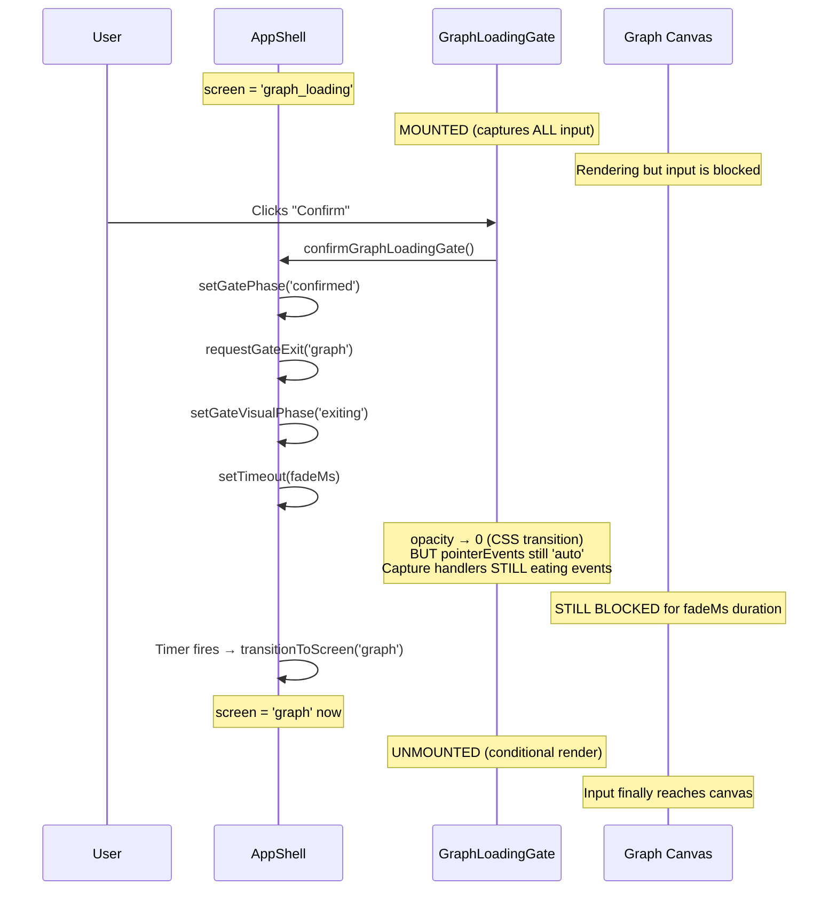

# Graph Screen Runtime Dead — Forensic Report

**Date**: 2026-02-16  
**Scope**: Why graph screen (`screen === 'graph'`) is completely inert (no drag, no physics, no wheel zoom) while the preview box in EnterPrompt works perfectly.  
**Method**: Exhaustive static code trace of all overlay/shield/gate/transition wrappers in the graph-screen render path.

---

## Root Cause (Plain English)

The graph screen's input is killed by **`GraphLoadingGate`** whenever the user enters the graph through the `graph_loading` → `graph` transition — specifically because the gate's **unconditional capture-phase event handlers** (`onPointerDownCapture`, `onPointerMoveCapture`, `onPointerUpCapture`, `onWheelCapture`) call `stopPropagation()` and `preventDefault()` **regardless of gate phase, visual phase, or interaction-locked state**.

The gate is only conditionally mounted via `screen === 'graph_loading'` ([renderScreenContent.tsx:147](file:///c:/Users/maulana/Downloads/obsidian-graph-node-google/src/screens/appshell/render/renderScreenContent.tsx#L147)), so once the screen transitions to `'graph'`, the gate unmounts and should stop blocking. However, the problem is that **the gate exit flow uses a timer-based fade** ([AppShell.tsx:328-334](file:///c:/Users/maulana/Downloads/obsidian-graph-node-google/src/screens/AppShell.tsx#L328-L334)) which keeps `screen === 'graph_loading'` alive for `GRAPH_LOADING_SCREEN_FADE_MS` milliseconds **while the gate is fading out** — and during this entire fade-out period, the capture handlers continue to eat ALL pointer and wheel events.

The real structural issue: the `confirmGraphLoadingGate` callback ([AppShell.tsx:662-676](file:///c:/Users/maulana/Downloads/obsidian-graph-node-google/src/screens/AppShell.tsx#L662-L676)) sets `gateVisualPhase` to `'exiting'` and starts a timer, but the screen **remains `'graph_loading'`** until the timer fires `transitionToScreen('graph')`. During this window, `GraphLoadingGate` is still mounted and its capture handlers are unconditionally blocking all input.

Additionally, there is a secondary concern: if the gate exit timer fails or if `confirmGraphLoadingGate` is never called (e.g. auto-confirm not wired, or `gatePhase` never reaches `'done'`), the gate remains mounted permanently, creating a fully "dead" graph screen.

> [!CAUTION]
> The preview box works because it **never goes through `graph_loading`**. The preview mounts `GraphPhysicsPlayground` directly without `GraphLoadingGate`, `GraphRuntimeLeaseBoundary`, or `GraphScreenShell` wrappers. It's the same runtime but without the gating layer.

---

## Evidence Map — Five Critical Suspects

### 1. GraphLoadingGate — **PRIMARY BLOCKER** ✅ CONFIRMED

| Item | Detail |
|------|--------|
| **File** | [GraphLoadingGate.tsx](file:///c:/Users/maulana/Downloads/obsidian-graph-node-google/src/screens/appshell/render/GraphLoadingGate.tsx) |
| **Lines** | 190–196 |
| **Mount condition** | `screen === 'graph_loading'` ([renderScreenContent.tsx:147](file:///c:/Users/maulana/Downloads/obsidian-graph-node-google/src/screens/appshell/render/renderScreenContent.tsx#L147)) |
| **Symptom** | Gate captures ALL pointer + wheel events unconditionally |

**Exact blocking code (lines 190–196):**
```tsx
onPointerDownCapture={(e) => e.stopPropagation()}
onPointerMoveCapture={(e) => e.stopPropagation()}
onPointerUpCapture={(e) => e.stopPropagation()}
onWheelCapture={(e) => {
    e.preventDefault();
    e.stopPropagation();
}}
```

These handlers run in **capture phase** and are **unconditional** — they fire regardless of `phase`, `visualPhase`, `interactionLocked`, or opacity. Even when the gate is at opacity 0 during fade-out (`visualPhase === 'exiting'`), these handlers still eat every event.

**Root style (line 33):**
```tsx
pointerEvents: 'auto',  // Gate always receives pointer events
```

**Keyboard blocking (lines 150-174):**
The `onKeyDownCapture` handler also blocks when `isInteractionBlocked` is true (which includes `isFadingOut`).

**Why this is the root cause:**
- The gate has `position: absolute; inset: 0; width: 100%; height: 100%; zIndex: 10` (lines 22-36)
- It sits on TOP of the graph canvas inside `GraphScreenShell`
- During `screen === 'graph_loading'`, it completely covers and captures all input
- Even during fade-out (opacity transitioning to 0), `pointerEvents: 'auto'` + capture handlers = dead graph

### 2. OnboardingLayerHost Input Shield — **NOT ACTIVE** on graph screen

| Item | Detail |
|------|--------|
| **File** | [OnboardingLayerHost.tsx](file:///c:/Users/maulana/Downloads/obsidian-graph-node-google/src/screens/appshell/transitions/OnboardingLayerHost.tsx) |
| **Lines** | 55–63, 111–116 |
| **Shield mounts when** | `isCrossfading === true` |
| **Active on graph screen?** | **NO** |

The shield (lines 111-116) has `pointerEvents: 'auto', zIndex: 2` and stops pointer/wheel propagation. However, `shouldUseOnboardingLayerHost` ([AppShell.tsx:799-806](file:///c:/Users/maulana/Downloads/obsidian-graph-node-google/src/screens/AppShell.tsx#L799-L806)) returns `false` for graph-class screens:
```tsx
if (isGraphClassScreen(screen)) return false; // line 800 — exits immediately
```

**Verdict**: Ruled out. Never active during `screen === 'graph'` or `screen === 'graph_loading'`.

### 3. useOnboardingWheelGuard — **NOT ACTIVE** on graph screen

| Item | Detail |
|------|--------|
| **File** | [useOnboardingWheelGuard.ts](file:///c:/Users/maulana/Downloads/obsidian-graph-node-google/src/screens/appshell/transitions/useOnboardingWheelGuard.ts) |
| **Lines** | 78 (capture listener), 72 (preventDefault) |
| **Active when** | `onboardingActive === true` |
| **Active on graph screen?** | **NO** |

The guard hooks a window-level capture-phase wheel listener that calls `event.preventDefault()`. However, `onboardingActive` on [AppShell.tsx:215](file:///c:/Users/maulana/Downloads/obsidian-graph-node-google/src/screens/AppShell.tsx#L215):
```tsx
const onboardingActive = isOnboardingScreen(screen) || isBlockingInput;
```
- `isOnboardingScreen('graph')` → `false` (graph is class `'graph'` per [screenTypes.ts:9-10](file:///c:/Users/maulana/Downloads/obsidian-graph-node-google/src/screens/appshell/screenFlow/screenTypes.ts#L9-L10))
- `isBlockingInput` requires `isOnboardingScreen(screen)` to be true ([useOnboardingTransition.ts:153](file:///c:/Users/maulana/Downloads/obsidian-graph-node-google/src/screens/appshell/transitions/useOnboardingTransition.ts#L153)) → also `false`

**Verdict**: Ruled out. Guard is inactive when screen is `'graph'`.

> [!NOTE]
> The guard **does** correctly exempt preview wheel events via `isInsideSampleGraphPreviewRoot()` checks (lines 26-27). This is why the preview box works even on the prompt screen where the guard IS active.

### 4. GraphRuntimeLeaseBoundary — **NOT BLOCKING**

| Item | Detail |
|------|--------|
| **File** | [GraphRuntimeLeaseBoundary.tsx](file:///c:/Users/maulana/Downloads/obsidian-graph-node-google/src/runtime/GraphRuntimeLeaseBoundary.tsx) |
| **Mount condition** | Always mounted in graph-class screens |
| **Blocking?** | **NO** |

The boundary renders children when lease is allowed (line 93: `return <>{children}</>`) and the `graph-screen` owner always wins the lease (it pre-empts other owners per [graphRuntimeLease.ts:135-149](file:///c:/Users/maulana/Downloads/obsidian-graph-node-google/src/runtime/graphRuntimeLease.ts#L135-L149)). The boundary passes `blockOnDeny={false}` (default) in [renderScreenContent.tsx:119-122](file:///c:/Users/maulana/Downloads/obsidian-graph-node-google/src/screens/appshell/render/renderScreenContent.tsx#L119-L122), so even if denied it still renders children. No event interception.

**Verdict**: Ruled out.

### 5. GraphScreenShell — **NOT BLOCKING**

| Item | Detail |
|------|--------|
| **File** | [GraphScreenShell.tsx](file:///c:/Users/maulana/Downloads/obsidian-graph-node-google/src/screens/appshell/render/GraphScreenShell.tsx) |
| **Lines** | 70-81 |

Clean layout component. No `pointerEvents` manipulation, no event handlers, no overlays. Just flex layout with sidebar pane reservation and `GraphViewportProvider`.

**Verdict**: Ruled out.

---

## Detailed Gate Exit Timeline (the failure window)



**Critical window**: Between `requestGateExit()` and the timer firing `transitionToScreen('graph')`, the graph is visually fading in but input is completely dead. If `fadeMs` is long or the timer doesn't fire (edge case), the graph stays dead permanently.

**Failure scenario for permanently dead graph**: If `gatePhase` never reaches `'done'` (e.g. `computeGraphLoadingGateBase` returns a phase that never transitions to `'done'`), the `confirmGraphLoadingGate` callback (line 664: `if (gatePhase !== 'done') return;`) will never execute, and `requestGateExit` is never called, leaving the gate mounted forever on `screen === 'graph_loading'`.

---

## Why Preview Works

The preview box in `EnterPrompt` mounts `GraphPhysicsPlayground` (which wraps `GraphPhysicsPlaygroundInternal`) **directly** — without any of these wrappers:

| Wrapper | Graph Screen | Preview Box |
|---------|-------------|-------------|
| `GraphScreenShell` | ✅ | ❌ |
| `GraphRuntimeLeaseBoundary` | ✅ | ❌ (or separate instance) |
| `GraphLoadingGate` | ✅ (when `graph_loading`) | ❌ |
| `OnboardingLayerHost` shield | ❌ (but theoretically could) | ❌ |
| `useOnboardingWheelGuard` | Active on prompt screen | Exempted via `isInsideSampleGraphPreviewRoot` |

The preview's canvas receives pointer and wheel events directly because there's no absolute-positioned overlay with capture handlers sitting on top of it.

---

## Minimal Bedrock Patch Plan

> [!IMPORTANT]
> These are structural fixes, not duct tape. Each addresses a specific contract violation.

### Fix 1: Make GraphLoadingGate capture handlers conditional on visual state

**File**: [GraphLoadingGate.tsx:190-196](file:///c:/Users/maulana/Downloads/obsidian-graph-node-google/src/screens/appshell/render/GraphLoadingGate.tsx#L190-L196)

**Problem**: Capture handlers are unconditional — they block even during fade-out.

**Fix**: Set `pointerEvents: 'none'` when `visualPhase === 'exiting'` (opacity is transitioning to 0).

```diff
 const rootVisualStyle: React.CSSProperties = {
     ...ROOT_STYLE,
     opacity: isFadingIn || isFadingOut ? 0 : 1,
     transition: fadeMs > 0 ? `opacity ${fadeMs}ms ${fadeEasing}` : 'none',
+    pointerEvents: isFadingOut ? 'none' : 'auto',
 };
```

**Why this is safe**: During fade-out, the gate is visually disappearing. The user should be able to interact with the graph canvas underneath. The gate has already recorded its final state (`'confirmed'`).

### Fix 2: Gate self-unmount guard

**File**: [renderScreenContent.tsx:147-162](file:///c:/Users/maulana/Downloads/obsidian-graph-node-google/src/screens/appshell/render/renderScreenContent.tsx#L147-L162)

**Problem**: Gate is mounted based solely on `screen === 'graph_loading'`. If screen gets stuck, gate blocks forever.

**Fix**: Add a secondary unmount condition: if `gateVisualPhase === 'exiting'`, set `pointerEvents: 'none'` on the gate root (already covered by Fix 1). Optionally, add a safety timeout that force-transitions to `'graph'` if the gate exit timer doesn't fire within 2× the fade duration.

### Fix 3: Invariant — "no invisible input shield" contract

**File**: [GraphLoadingGate.tsx](file:///c:/Users/maulana/Downloads/obsidian-graph-node-google/src/screens/appshell/render/GraphLoadingGate.tsx)

**Add a dev-mode invariant** that warns if the gate root is mounted with `opacity < 0.01` AND `pointerEvents !== 'none'`:

```tsx
React.useEffect(() => {
    if (!import.meta.env.DEV) return;
    if (isFadingOut && rootRef?.current) {
        const computed = getComputedStyle(rootRef.current);
        if (computed.pointerEvents !== 'none') {
            console.warn('[GraphLoadingGate] INVARIANT: gate is fading out but pointerEvents=%s', computed.pointerEvents);
        }
    }
}, [isFadingOut]);
```

This prevents future regressions by making the "invisible shield" state immediately visible in dev console.

---

## Risks & How to Avoid Breaking Boxed Preview

| Risk | Mitigation |
|------|-----------|
| Fix 1 changes gate behavior during fade | Fade-out only occurs when transitioning to `'graph'` — the gate is already closing. Input reaching canvas during fade-out is correct behavior. |
| Fix 1 could let clicks through during error state | `isFadingOut` is only true during `visualPhase === 'exiting'`, which is only set by `requestGateExit`. The error state keeps `visualPhase === 'visible'`. No risk. |
| Preview box doesn't use GraphLoadingGate at all | All fixes are scoped to GraphLoadingGate — zero impact on preview. |
| OnboardingWheelGuard could regress preview | No changes to this guard. The existing `isInsideSampleGraphPreviewRoot` exemption remains intact. |

---

## How to Verify Quickly

### Dev Console State Inspection
```js
// Check current gate state on graph screen:
document.querySelector('[data-graph-loading-gate]')
// Should be null when screen=graph. If non-null, gate is stuck.

// Check shell data attributes:
document.querySelector('[data-gate-phase]')?.getAttribute('data-gate-phase')
// Should be 'idle' when screen=graph

document.querySelector('[data-gate-visual-phase]')?.getAttribute('data-gate-visual-phase')
// Should be 'visible' when screen=graph (gate not mounted, so attribute is on shell)
```

### Automated Verification
After applying fixes, verify:
1. `data-graph-loading-gate` element is `null` on graph screen
2. Wheel events reach the canvas (`[RenderLoop]` logs show frames advancing)
3. Pointer down on a node triggers `[PointerTrace]` logs
4. Preview box still has drag + zoom (regression check)

### Key Log Lines to Watch
| Log Pattern | Meaning |
|-------------|---------|
| `[GateFade] exit_start` | Gate exit timer started |
| `[GateFade] exit_commit` | Gate exit timer fired, transitioning to graph |
| `[RenderLoop] first_frame` | Canvas render loop started |
| `[PointerTrace] RenderLoop: Grabbed node` | Drag interaction working |
| `[OnboardingGesture] wheel prevented` | Wheel guard is ACTIVE (should NOT appear on graph screen) |
