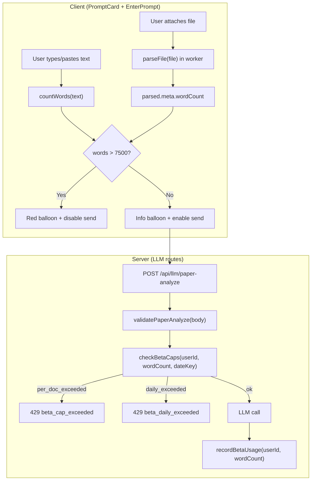

# Beta Caps System — Forensic Scan Report
**Date:** 2026-02-18  
**Goal:** Identify cleanest way to implement per-doc 7,500 word cap and per-user 150,000 word/day cap during beta, with server-authoritative enforcement and prompt-screen UX.

---

## A. Prompt UX + Disable-Send Hook Points

### A.1 Component Tree

```
AppShell
  └─ renderScreenContent()                     [src/screens/appshell/render/renderScreenContent.tsx]
       └─ EnterPrompt                           [src/screens/EnterPrompt.tsx]
            ├─ PromptCard                        [src/components/PromptCard.tsx]
            │    ├─ <textarea> (user input)       L188–197
            │    ├─ <button> send                 L270–288
            │    ├─ statusMessage banner           L135–150
            │    └─ file chip row                  L167–186
            ├─ drag overlay                       L141–149
            └─ unsupported file error overlay      L152–164
```

### A.2 Existing Status Banner (Ready-Made Hook)

`PromptCard` already accepts:

```typescript
// src/components/PromptCard.tsx L36–47
statusMessage?: { kind: 'error'; text: string } | null;
onDismissStatusMessage?: () => void;
```

This renders at **L135–150** as a red-background banner with dismiss button, styled by `PROMPT_STATUS_BANNER_STYLE` (L353–365). Currently only supports `kind: 'error'`.

**EnterPrompt** wires it at **L135**:
```typescript
statusMessage={analysisErrorMessage ? { kind: 'error', text: analysisErrorMessage } : null}
```

> [!TIP]
> To support info-level (under-limit) vs error-level (over-limit) balloons, extend `statusMessage.kind` to `'info' | 'warning' | 'error'` and add corresponding style variants.

### A.3 Send Button Disable Hook

`PromptCard` accepts `disabled?: boolean` (L40, L53). Currently only passed as `false` by default. The send button respects it at **L276** (`disabled={disabled}`) and `handleSubmit` checks it at **L89** (`if (disabled) return;`).

**Key decision:** Who computes `disabled`? Options:
1. **EnterPrompt** computes `disabled` based on word count state and passes it down — **cleanest**.
2. **PromptCard** internally checks word count — violates separation of concerns.

**Recommendation:** Option 1 — `EnterPrompt` owns the cap logic, passes computed `disabled` + `statusMessage` to `PromptCard`.

### A.4 Submit Dispatch Flow

1. User clicks send → `PromptCard.handleSubmit()` (L88)
2. → calls `onSubmit(trimmed)` (L92 or L97)
3. → `EnterPrompt.handlePromptSubmit(text)` (L49)
4. → if text: `onSubmitPromptText(text)` → `setPendingAnalysis({kind:'text', text, ...})` (L215–218)
5. → if file: `onSubmitPromptFile(file)` → `setPendingAnalysis({kind:'file', file, ...})` (L220–224)
6. → `transitionToScreen('graph_loading')`

**Cap enforcement point:** Between step 1 and step 2. If `disabled` is true, `handleSubmit` returns early at L89.

### A.5 Where `analysisErrorMessage` Is Set

In `renderScreenContent.tsx`, `promptAnalysisErrorMessage` is passed as a prop. Currently it surfaces server errors from a failed analysis. The same prop mechanism can carry cap violation messages originating from the *client* before any submit attempt.

---

## B. Word Counting Inventory (Paste + Upload)

### B.1 Existing `countWords` Implementations

| Location | Signature | Used for |
|---|---|---|
| `src/money/estimateCost.ts:3` | `text.trim().split(/\s+/).filter(Boolean).length` | IDR cost estimation |
| `src/playground/GraphPhysicsPlaygroundShell.tsx:103` | `text.trim().split(/\s+/).filter(w => w.length > 0).length` | Synthetic doc for pasted text |
| `src/document/nodeBinding.ts:39` | Same as above | Document → node binding |
| `src/lib/devExport/devExportToSavedInterfaceRecord.ts:25` | Same | Saved interface export |

All use the same logic: `text.trim().split(/\s+/).filter(Boolean).length`. This is the canonical word count method.

### B.2 Word Count Availability by Input Type

#### Pasted Text (kind: 'text')

| When | Available? | How |
|---|---|---|
| **On keystroke** in `PromptCard` textarea | ✅ Immediate | `inputText.split(/\s+/).filter(Boolean).length` |
| **On submit** in `EnterPrompt` | ✅ Immediate | Same on `trimmed` text |

**Verdict:** Trivially available at prompt time. Word count can be computed on every keystroke (or debounced) to drive the status balloon and disable state.

#### Uploaded File (kind: 'file')

| When | Available? | How |
|---|---|---|
| **On file selection** in `PromptCard` | ❌ Not yet | File is a raw `File` object, not parsed |
| **On submit** in `EnterPrompt` | ❌ Not yet | File is passed as raw `File` |
| **After screen transition** in `GraphPhysicsPlaygroundShell` | ✅ After async parse | `documentContext.parseFile(file)` → `parsed.meta.wordCount` |

> [!WARNING]
> **Critical gap:** For uploaded files, word count is NOT available on the prompt screen. The file is parsed only AFTER the user transitions to the graph screen (L1240: `parsed = await documentContext.parseFile(file)`).

### B.3 Options for Upload Word Count at Prompt Time

| Option | Approach | Pros | Cons |
|---|---|---|---|
| **(a) Pre-parse on selection** | Call `DocumentProvider.parseFile(file)` (or a lightweight equivalent) when the file is attached in EnterPrompt | Exact word count available pre-submit; can disable send button immediately | Requires importing document parser into prompt screen; adds latency on file attach; PDF parsing may take 100–500ms |
| **(b) Heuristic estimate** | Use `file.size` as a rough proxy (e.g. ~5 chars/word → `file.size / 5` for text; ~6 chars/word for PDF) | Zero latency; no parser import | Inaccurate — PDFs have binary overhead, DOCX is zipped XML; could wrongly block/allow |
| **(c) Server-only enforcement** | Skip client pre-check for files; let server validate word count; return error | Authoritative; no client parsing needed | Violates "send disabled while over-limit" UX requirement; user sees error after waiting for graph analysis flow |
| **(d) Lightweight client parse** | Import only the relevant parser (text is trivial; PDF/DOCX need their respective libs), parse in a Web Worker, compute word count | Exact count; non-blocking (worker); reuses existing parser infrastructure | Must handle async result; brief "checking…" state before enabling/disabling send |

### B.4 Recommendation

**Option (d) — lightweight client parse on file attach** is the cleanest:

1. When user attaches a file in `EnterPrompt`, start parsing it in the background using the existing `WorkerClient` (which already handles pdf/docx/text).
2. Show a brief "Checking document…" info balloon while parsing.
3. Once word count is available:
   - If ≤ 7,500 words → show info balloon "Document: X,XXX words" → enable send
   - If > 7,500 words → show error balloon "Document is more than 7500 words" → disable send
4. Store `parsedWordCount` in `EnterPrompt` state.

**Why not (a):** Option (a) is equivalent to (d) but phrased differently; (d) emphasizes the worker-based non-blocking aspect.

**Why not (c):** Violates the UX requirement of disabling send pre-submit.

---

## C. Backend Enforcement Seams + Shared Guard Location

### C.1 LLM Routes That Accept User Text/Doc

| Route | File | Text field | Text origin |
|---|---|---|---|
| `POST /api/llm/paper-analyze` | `src/server/src/routes/llmAnalyzeRoute.ts` | `body.text` (up to 80,000 chars) | Pasted text or parsed document text |
| `POST /api/llm/chat` | `src/server/src/routes/llmChatRoute.ts` | `body.userPrompt` (up to 4,000 chars) + `body.context.documentText` (up to 3,000 chars) | Chat messages; document text is contextual |
| `POST /api/llm/prefill` | `src/server/src/routes/llmPrefillRoute.ts` | `body.nodeLabel` (up to 200 chars) + `body.content.summary` (up to 20,000 chars) | Node-level prefill; not document-level |

**Per-doc cap:** Only applies to `/api/llm/paper-analyze` — this is the route that receives the full document text and triggers analysis. Chat and prefill send fragments, not the full doc.

**Daily cap:** Applies to ALL routes — every LLM call consumes words. But what counts as "words used"? Options:
- (i) Count words of the *input text* sent to the LLM → simple, deterministic
- (ii) Count *total tokens* used (input + output) → more accurate cost proxy but harder to present to users
- **Recommendation:** Count words of the input text only. This is what users see and understand. The `body.text` word count for analyze, `body.userPrompt` word count for chat, etc.

### C.2 Current Validation Flow

Each route follows:

```
body → validate(body) → [if error: 400/413] → precheckBalance → [if error: 402] → LLM call → chargeUsage
```

The cap check should be inserted **after validation, before the LLM call**:

```
body → validate(body) → [if error: 400/413] → betaCapCheck(userId, wordCount) → [if error: 429/403] → LLM call → recordDailyUsage(userId, wordCount)
```

### C.3 Suggested Shared Guard Function

**New file:** `src/server/src/llm/betaCaps.ts`

```typescript
// Proposed interface:
export async function checkBetaCaps(opts: {
  userId: string;
  wordCount: number;
  dateKey: string;
  perDocLimit: number;     // 7500
  dailyLimit: number;      // 150000
}): Promise<{
  ok: boolean;
  reason?: 'per_doc_exceeded' | 'daily_exceeded';
  wordCount: number;
  dailyUsed: number;
  dailyRemaining: number;
}>

export async function recordBetaUsage(opts: {
  userId: string;
  wordCount: number;
  requestId: string;
  dateKey: string;
}): Promise<void>
```

**Hook points in each route:**

1. **llmAnalyzeRoute.ts** — After `validatePaperAnalyze(body)` succeeds (L111) and before `precheckBalance` (L219). Word count = `body.text.split(/\s+/).filter(Boolean).length`.
2. **llmChatRoute.ts** — After `validateChat(body)` succeeds. Word count = `body.userPrompt.split(/\s+/).filter(Boolean).length`.
3. **llmPrefillRoute.ts** — After `validatePrefill(body)` succeeds. Word count = combined word count of nodeLabel + content.summary.

**After successful LLM response:** Call `recordBetaUsage()` to increment daily usage. This ensures failed requests don't consume the cap.

### C.4 Error Response Shape

```json
{
  "ok": false,
  "code": "beta_cap_exceeded",
  "error": "Document exceeds 7,500 word beta limit",
  "word_count": 12345,
  "daily_used": 148000,
  "daily_limit": 150000,
  "per_doc_limit": 7500
}
```

HTTP status: **429** (rate limit) or a custom **403** with distinct `code`. Recommend **429** to match the existing rate-limiter pattern.

### C.5 Client Handling

The existing error handling in `paperAnalyzer.ts`, `fullChatAi.ts`, and `prefillSuggestion.ts` already handles non-ok responses generically. A new `code: 'beta_cap_exceeded'` can be caught and surfaced via `documentContext.setAIError(...)` or a dedicated cap-exceeded UI.

---

## D. Daily Usage Storage Options + Day-Boundary Notes

### D.1 Existing Daily Usage Infrastructure

| Table | Schema | Used by |
|---|---|---|
| `openai_free_pool_daily` | `(date_key PK, remaining_tokens, updated_at)` | `providerSelector.ts`, `freePoolAccounting.ts` |
| `openai_free_user_daily_usage` | `(date_key, user_id) PK, used_tokens, updated_at` | Same — tracks tokens/day/user |
| `openai_free_pool_ledger` | `(request_id PK, date_key, user_id, tokens, created_at)` | Per-request deduplication ledger |

These tables track **tokens** (not words) for the free pool system.

### D.2 Day-Boundary Mechanism

**File:** `src/server/src/llm/providerSelector.ts`

```typescript
function getDateKeyUtc(date: Date = new Date()): string {
  const year = date.getUTCFullYear();
  const month = String(date.getUTCMonth() + 1).padStart(2, "0");
  const day = String(date.getUTCDate()).padStart(2, "0");
  return `${year}-${month}-${day}`;
}

export function getTodayDateKey(): string {
  return getDateKeyUtc();
}
```

Uses **UTC dates** (not local timezone). This means the daily cap resets at 00:00 UTC = 07:00 WIB. This is acceptable for beta.

### D.3 Two Options for Daily Word Usage Storage

#### Option A: Extend Existing `openai_free_user_daily_usage`

Add a new column `used_words` alongside `used_tokens`:

```sql
ALTER TABLE openai_free_user_daily_usage ADD COLUMN used_words bigint DEFAULT 0;
```

**Pros:** No new table; reuses existing upsert/read patterns; one query for both tokens + words.
**Cons:** Mixes two conceptually different systems (free pool tokens vs beta word caps); migration required; if free pool is removed later, the word cap column goes with it.

#### Option B: New Dedicated Table

```sql
CREATE TABLE beta_daily_word_usage (
  date_key   text NOT NULL,
  user_id    text NOT NULL,
  used_words bigint NOT NULL DEFAULT 0,
  updated_at timestamptz NOT NULL DEFAULT now(),
  PRIMARY KEY (date_key, user_id)
);
```

**Pros:** Clean separation; independent lifecycle from free pool; easy to remove post-beta.
**Cons:** New table creation; new code path.

### D.4 Recommendation

**Option B (new table).** Reasons:
- Beta caps are a temporary system (will be removed when payment returns)
- Mixing into the free pool table creates coupling to a different system
- Clean add + clean remove when beta ends
- The code pattern is identical to existing `openai_free_user_daily_usage` upserts — easy to copy

### D.5 Auth + UserId Source

All LLM routes use `deps.requireAuth` middleware → `res.locals.user` → `deps.getUserId(user)` → returns `String(user.id)`.

Same `userId` should be used for daily word cap tracking.

---

## E. Recommended Clean Approach (Advice Only, Minimal Diffs)

### E.1 Overview



### E.2 Implementation Tiers (Smallest → Full)

#### Tier 1: Server-Only Per-Doc Cap (2 files, ~20 lines)

| File | Change |
|---|---|
| `src/server/src/llm/limits.ts` | Add `betaPerDocWordLimit: 7500` |
| `src/server/src/routes/llmAnalyzeRoute.ts` | After validation, compute `words = body.text.split(/\s+/).filter(Boolean).length`, reject if > 7500 |

**Effect:** Server blocks over-limit documents. Client sees generic "analysis failed" error on graph screen. Not ideal UX but functional.

#### Tier 2: Client UX for Pasted Text (+2 files, ~40 lines)

| File | Change |
|---|---|
| `src/screens/EnterPrompt.tsx` | Add word count state tracking on `promptText` changes; compute `disabled` + `statusMessage` |
| `src/components/PromptCard.tsx` | Extend `statusMessage.kind` to support `'info'` with different styling |

**Effect:** "Document is more than 7500 words" balloon + disabled send for pasted text. Uploads still rely on server-side check.

#### Tier 3: Client UX for Uploaded Files (+1 file modification, ~30 lines)

| File | Change |
|---|---|
| `src/screens/EnterPrompt.tsx` | On file attach, call `parseFile(file)` in worker; await `meta.wordCount`; update `disabled` + `statusMessage` |

**Effect:** Full client-side cap UX for both paste and upload.

#### Tier 4: Server Daily Cap (+1 new file, +3 route modifications, +1 migration, ~80 lines)

| File | Change |
|---|---|
| `src/server/src/llm/betaCaps.ts` | **[NEW]** `checkBetaCaps()` + `recordBetaUsage()` |
| `src/server/src/routes/llmAnalyzeRoute.ts` | Insert `checkBetaCaps()` after validation; `recordBetaUsage()` after successful LLM call |
| `src/server/src/routes/llmChatRoute.ts` | Same pattern |
| `src/server/src/routes/llmPrefillRoute.ts` | Same pattern |
| DB migration | Create `beta_daily_word_usage` table |

**Effect:** Server-authoritative daily 150k word cap. Multi-device/refresh safe.

#### Tier 5: Client Daily Cap Awareness (+1 file, ~20 lines)

| File | Change |
|---|---|
| `src/screens/EnterPrompt.tsx` or `src/store/betaCapsStore.ts` | **[NEW]** Fetch daily usage from server on mount; show balloon when approaching/exceeding daily limit |

**Effect:** Proactive daily cap warning on prompt screen.

### E.3 Minimal Viable Patch (Tiers 1 + 2 + 4)

This gives you:
- ✅ Server blocks >7500 word docs (authoritative)
- ✅ Client disables send for >7500 word pasted text (smooth UX)
- ✅ Server tracks and enforces 150k words/day (multi-device safe)
- ⚠️ Uploaded files over 7500 words get a server error (acceptable for beta)

**Total estimated diff:** ~150 lines across 5 files + 1 new file + 1 DB migration.

---

## F. Risks + How to Make It Prod-Solid

### F.1 Re-Send Same Document

If a user sends the same document twice, it should count **twice** against the daily cap. Each LLM call consumes resources regardless of document identity. The `recordBetaUsage()` function should use `requestId` as the dedup key (same pattern as `openai_free_pool_ledger`).

### F.2 Partial Failures

If the LLM call fails (network error, provider error, etc.), the words should **NOT** be counted against the daily cap.

**Implementation:** Call `recordBetaUsage()` only after a successful LLM response, not before. This means the check (read) happens pre-LLM, and the record (write) happens post-LLM.

**Race condition:** If two requests are sent concurrently, both pass the daily check, and both succeed, the user might exceed 150k by one request's worth. This is acceptable for beta — the alternative (pessimistic locking) adds latency and complexity.

### F.3 Concurrency / Race Conditions on Daily Usage

The existing `openai_free_user_daily_usage` pattern uses:
```sql
INSERT ... ON CONFLICT (date_key, user_id) DO NOTHING
UPDATE ... SET used_words = used_words + $3
```

This is **atomic increment** — safe under concurrent writes. The `used_words + $3` is processed by PostgreSQL's row-level lock, preventing lost updates.

### F.4 Word Count Consistency (Client vs Server)

The client and server must use the same word counting algorithm. Currently all implementations use `text.trim().split(/\s+/).filter(Boolean).length`. Recommend extracting a shared `countWords()` into a utility that both client and server can import.

### F.5 Upload Files: Gap Between Client + Server Word Count

For uploaded files, the text extracted on the client (via `pdfjs-dist` or `mammoth`) and the text sent to the server (which receives the *extracted text*, not the raw file) should produce the same word count. The pipeline is:

1. Client parses file → extracts `parsed.text`
2. Client sends `parsed.text` to server as `body.text`
3. Server counts words of `body.text`

Since client and server count words on the same string, they will agree.

### F.6 `safeText` Truncation in `paperAnalyzer.ts`

**File:** `src/ai/paperAnalyzer.ts:263`

```typescript
const safeText = text.slice(0, 6000);
```

The analyzer truncates to 6,000 chars before sending to the server. At ~5 chars/word, this is ~1,200 words — well under the 7,500 cap. However, the daily usage should be counted based on the **original** document word count (what the user submitted), not the truncated version. This ensures the daily cap accurately reflects document sizes.

**Key insight:** The per-doc cap checks the *original document* word count. The daily usage records the *original document* word count. But the LLM only processes the truncated text. This is correct behavior — the cap limits what users can *submit*, not what the LLM processes.

### F.7 Chat + Prefill: Do They Count Toward Daily Cap?

Chat messages (`body.userPrompt`, max 4,000 chars ≈ 800 words) and prefill requests (`body.nodeLabel`, max 200 chars) are small. But at high volume, they add up. Two options:

1. **Count all LLM input words** (analyze + chat + prefill) toward the daily 150k cap → simple, comprehensive
2. **Count only analyze words** → simpler, but users could abuse chat/prefill without hitting cap

**Recommendation:** Option 1 — count all. The daily cap is generous (150k words) and chat/prefill words are tiny per-request.

### F.8 Time Zone UX

The daily cap resets at 00:00 UTC = 07:00 WIB. If a user hits the cap at 6pm WIB, they must wait until 7am WIB (13 hours). If they hit it at 8am WIB, they must wait until 7am next day (23 hours). This is consistent but may feel unfair to users in later time zones.

**Mitigation for beta:** Acceptable. Mention UTC in the error message or show "resets at 07:00 WIB" in the balloon text.

### F.9 Disabling Post-Beta

When payment gating returns:
1. Remove `BETA_FREE_MODE=1` env var
2. Drop `beta_daily_word_usage` table
3. Remove `checkBetaCaps()` + `recordBetaUsage()` calls
4. Remove client-side cap balloon + word count logic
5. Everything reverts to rupiah-based billing

---

## Appendix: Complete File Inventory

### Files to Modify

| File | Change type | Purpose |
|---|---|---|
| `src/server/src/llm/limits.ts` | Add constants | `betaPerDocWordLimit`, `betaDailyWordLimit` |
| `src/server/src/routes/llmAnalyzeRoute.ts` | Add guard | Per-doc + daily word cap check |
| `src/server/src/routes/llmChatRoute.ts` | Add guard | Daily word cap check |
| `src/server/src/routes/llmPrefillRoute.ts` | Add guard | Daily word cap check |
| `src/screens/EnterPrompt.tsx` | Add state | Word count tracking, disabled/statusMessage logic |
| `src/components/PromptCard.tsx` | Extend props | Add `kind: 'info' | 'warning'` to `statusMessage`; add info-style banner |

### Files to Create

| File | Purpose |
|---|---|
| `src/server/src/llm/betaCaps.ts` | **[NEW]** `checkBetaCaps()`, `recordBetaUsage()`, word counting |
| DB migration script | **[NEW]** Create `beta_daily_word_usage` table |

### Files Read During Scan (Reference)

| File | What was checked |
|---|---|
| `src/components/PromptCard.tsx` | Props interface, submit flow, status banner, send button |
| `src/screens/EnterPrompt.tsx` | State management, submit dispatch, file attach |
| `src/screens/appshell/render/renderScreenContent.tsx` | How `onSubmitPromptText`/`onSubmitPromptFile` are wired |
| `src/playground/GraphPhysicsPlaygroundShell.tsx` | Where file parsing happens (L1240), pending analysis consumption |
| `src/document/parsers/pdfParser.ts` | PDF word count: `words.length` at L71 |
| `src/document/parsers/docxParser.ts` | DOCX word count: `words.length` at L45 |
| `src/document/parsers/textParser.ts` | Text word count: `words.length` at L31 |
| `src/document/types.ts` | `ParsedDocument.meta.wordCount` at L15 |
| `src/store/documentStore.tsx` | `parseFile()` lifecycle |
| `src/ai/paperAnalyzer.ts` | `analyzeDocument()` — `safeText` truncation, API call |
| `src/money/estimateCost.ts` | `countWords()` implementation |
| `src/server/src/llm/validate.ts` | Backend validation per route |
| `src/server/src/llm/limits.ts` | Current limits |
| `src/server/src/llm/providerRouter.ts` | `ProviderPolicyMeta.date_key` |
| `src/server/src/llm/providerSelector.ts` | `getTodayDateKey()` — UTC day boundary |
| `src/server/src/llm/freePoolAccounting.ts` | Existing daily usage table pattern |
| `src/server/src/routes/llmAnalyzeRoute.ts` | Full route flow |
| `src/server/src/routes/llmChatRoute.ts` | Full route flow |
| `src/server/src/routes/llmPrefillRoute.ts` | Full route flow |
